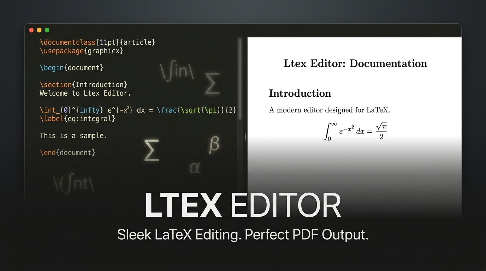

<div align="center">
  

  # Ltex Editor
  
  **A sleek, local-first LaTeX editor with an Apple HIG-inspired interface.**
</div>

<br />

## 📖 What is Ltex Editor?

Ltex Editor is a modern, beautifully designed LaTeX editor that runs completely offline on your local machine. Built with web technologies, it offers a dual-mode execution strategy: you can use it as a standalone, native desktop application (powered by Electron) or launch it directly in your web browser via a local Node.js server. 

The editor focuses on providing a distraction-free, Apple HIG (Human Interface Guidelines) inspired aesthetic, while remaining incredibly fast and functional.

## ✨ Key Features

- **Apple HIG-Inspired UI**: A clean, minimalistic, and intuitive interface featuring a frameless window design on the desktop app.
- **Dual Execution Modes**: 
  - **Native Desktop App**: A seamless Electron-based executable with a green desktop icon.
  - **Web Version**: Runs in your browser via a lightweight local Node.js server with Windows shortcut integration (blue globe icon).
- **Advanced Code Editor**: Powered by CodeMirror with a custom Monokai theme and a distinctive "white spotlight" active line highlight.
- **Live PDF Preview**: Blazing fast, fully offline PDF rendering using `PDF.js`, complete with zoom controls.
- **SyncTeX Integration**: Double-click anywhere on the PDF preview to instantly jump to the corresponding line of LaTeX code in the editor!
- **Resizable Layout**: A smooth, adjustable dual-pane layout managed by `Split.js`.
- **100% Offline & Local**: Your documents never leave your computer. Uses your system's existing TeX distribution.

## 🚀 Prerequisites

Before you begin, ensure you have the following installed on your machine:
- [Node.js](https://nodejs.org/) (for running the server and building the app)
- A local TeX distribution like [MiKTeX](https://miktex.org/) or [TeX Live](https://www.tug.org/texlive/)
  > **Note:** `pdflatex` and `synctex` must be available in your system's `PATH`.

## 🛠️ Installation & Usage

### 1. Clone the repository
```bash
git clone https://github.com/Bandetheighteen/ltex-editor.git
cd ltex-editor
```

### 2. Install dependencies
```bash
npm install
```

### 3. Run the Web Version
Start the local server:
```bash
npm start # or node server.js
```
Then, open your browser and navigate to `http://localhost:3000`.

*(Optional for Windows)*: You can use the provided PowerShell scripts (`install-shortcut.ps1`) to create desktop and start menu shortcuts that run the server silently via VBScript.

### 4. Run the Native Desktop App (Electron)
```bash
npm run start:electron # or electron electron-main.js
```

## 🏗️ Architecture

Ltex Editor shares the exact same frontend codebase (`public/main.js`) across both its Web and Native modes. 
- **Graceful Fallback API:** The frontend detects if it's running inside Electron (via `window.api` injected by `preload.js`) and uses IPC channels for rapid communication. If opened in a web browser, it gracefully falls back to standard HTTP `fetch()` requests.
- **Temporary File Management:** Compilation temporary files are safely written to a session directory in your OS's temp folder.

## 🤝 Contributing

Contributions, issues, and feature requests are welcome! Feel free to check the [issues page](https://github.com/Bandetheighteen/ltex-editor/issues).

## 📝 License

This project is licensed under the MIT License.
